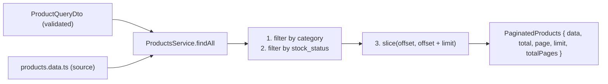

## Scope

- Modify [backend/src/app/products/products.service.ts](backend/src/app/products/products.service.ts): implement one public method `findAll(query: ProductQueryDto)`.
- Add a new domain interface for the paginated response.
- Update [backend/src/app/products/README.md](backend/src/app/products/README.md).
- Leave controller, main.ts, and the data file untouched.

## Data flow



## Files

### 1. New: `backend/src/app/products/interfaces/paginated-products.interface.ts`

The paginated envelope agreed on (`{ data, total, page, limit, totalPages }`) lives in a dedicated interface so both the service signature and any future consumer stay type-safe. Kept in `interfaces/` alongside `Product` — same folder role as before, no new directory.

```ts
import { Product } from './product.interface';

export interface PaginatedProducts {
  data: Product[];
  total: number;
  page: number;
  limit: number;
  totalPages: number;
}
```

### 2. Modify: `backend/src/app/products/products.service.ts`

Replace the empty class body with the real implementation.

```ts
import { Injectable } from '@nestjs/common';
import { products } from './data/products.data';
import { ProductQueryDto } from './dto/product-query.dto';
import { PaginatedProducts } from './interfaces/paginated-products.interface';
import { Product } from './interfaces/product.interface';

@Injectable()
export class ProductsService {
  private readonly defaultPage = 1;
  private readonly defaultLimit = 10;

  findAll(query: ProductQueryDto): PaginatedProducts {
    const page = query.page ?? this.defaultPage;
    const limit = query.limit ?? this.defaultLimit;

    const filtered = this.applyFilters(products, query);
    const total = filtered.length;
    const totalPages = total === 0 ? 0 : Math.ceil(total / limit);

    const offset = (page - 1) * limit;
    const data = filtered.slice(offset, offset + limit);

    return { data, total, page, limit, totalPages };
  }

  private applyFilters(
    source: readonly Product[],
    query: ProductQueryDto,
  ): Product[] {
    return source.filter((product) => {
      if (query.category !== undefined && product.category !== query.category) {
        return false;
      }
      if (
        query.stock_status !== undefined &&
        product.stock_status !== query.stock_status
      ) {
        return false;
      }
      return true;
    });
  }
}
```

Key decisions:

- **Sync method**, not async — the source is a plain in-memory array; wrapping in a Promise would be premature abstraction (project rule: "Do not overengineer").
- **Immutability preserved** — `Array.prototype.filter` and `slice` return new arrays; the imported `products` const is never mutated. `source: readonly Product[]` in `applyFilters` locks this at the type level.
- **Defaults in the service, not the DTO** — the DTO stays a pure transport-layer concern (Phase 4 decision); the service owns the business policy that "no page = page 1, no limit = 10 items".
- **Exact-match filters** — `category` is compared with `===` (case-sensitive), matching the spec's simple "Filter by category when provided" without adding normalization the spec didn't request. `stock_status` uses `===` on enum values (they are strings under the hood, so the comparison is exact).
- **Single traversal for filtering** — one `.filter()` handling both criteria rather than chaining two `.filter()` calls: minor micro-optimization, but mostly clearer intent ("keep products matching all provided criteria").
- **`totalPages = 0` when empty** — avoids returning `totalPages: 1` for an empty result set, which would be misleading for consumers.
- **No `NotFoundException` when out-of-range page** — the service returns `data: []` with correct `total` / `totalPages`. Callers can decide what to do; the spec says "Do not throw custom exceptions".

### 3. Update: `backend/src/app/products/README.md`

Rewrite the "Current files" and "Responsibility" sections to reflect the now-real service and add a short "Business logic" section covering:

- **Service responsibility** — owns the filtering + pagination logic; the controller (upcoming phase) will simply forward the validated DTO.
- **Implemented logic** — reads from `products.data.ts`, applies optional filters (`category`, `stock_status`) with exact match, then paginates via `page`/`limit` (defaults `1` / `10`), and returns a `PaginatedProducts` envelope with `data`, `total`, `page`, `limit`, `totalPages`.
- **Why filtering and pagination belong in the service** — they are business decisions (what "matches", what the page size default is, what shape callers receive), independent of transport. Keeping them here means the same behavior would be reusable if a GraphQL layer, CLI, or another controller were added later, and it keeps the controller thin per NestJS best practices.

Also refresh the "Files added in future phases" list — remove entries already delivered (dto/, entities [replaced by interfaces/], mock data) and keep the remaining ones (cache integration, tests).

## Non-changes

- [backend/src/app/products/products.controller.ts](backend/src/app/products/products.controller.ts) — untouched (route wiring is a later phase).
- [backend/src/main.ts](backend/src/main.ts), [backend/src/app.module.ts](backend/src/app.module.ts) — untouched.
- [backend/src/app/products/data/products.data.ts](backend/src/app/products/data/products.data.ts) — read-only from the service.

## Verification

- `npm run build` compiles successfully.
- Type-check confirms the new interface, the service method signature, and the readonly parameter contract.

## Deliverable summary (returned after execution)

- **Filtering logic**: single-pass `Array.prototype.filter` that keeps a product only if every provided criterion matches (`category` exact string equality, `stock_status` enum equality). Missing criteria are skipped, so no filter is applied for absent parameters.
- **Pagination logic**: `offset = (page - 1) * limit`, then `slice(offset, offset + limit)`. Defaults `page = 1`, `limit = 10`, applied in the service when the DTO fields are absent. `totalPages = ceil(total / limit)` (0 when total is 0).
- **Public methods added**: one — `findAll(query: ProductQueryDto): PaginatedProducts`. `applyFilters` is a private helper kept out of the public surface.