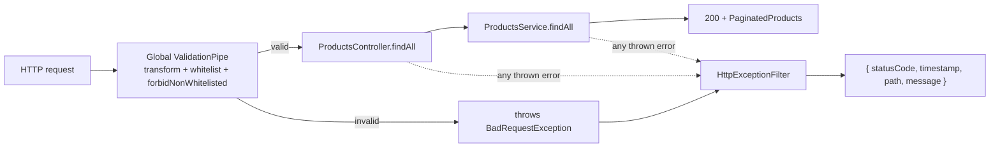

## Scope

- Create [backend/src/common/filters/http-exception.filter.ts](backend/src/common/filters/http-exception.filter.ts).
- Create [backend/src/common/filters/README.md](backend/src/common/filters/README.md) documenting the filter.
- Update [backend/src/common/README.md](backend/src/common/README.md) so `filters/` is no longer described as "empty".
- Update [backend/src/main.ts](backend/src/main.ts) to register the pipe and the filter globally.
- `app.module.ts` is **not required** here — we register via `app.useGlobalPipes` / `app.useGlobalFilters` in `main.ts`, which is the simplest option and enough because neither the pipe nor the filter has any dependency to inject. `APP_FILTER`/`APP_PIPE` tokens would only matter if we needed DI into them.

## Request/response pipeline after this phase



## Files

### 1. New: [backend/src/common/filters/http-exception.filter.ts](backend/src/common/filters/http-exception.filter.ts)

```ts
import {
  ArgumentsHost,
  Catch,
  ExceptionFilter,
  HttpException,
  HttpStatus,
  Logger,
} from '@nestjs/common';
import { Request, Response } from 'express';

interface ErrorResponseBody {
  statusCode: number;
  timestamp: string;
  path: string;
  message: string | string[];
}

@Catch()
export class HttpExceptionFilter implements ExceptionFilter {
  private readonly logger = new Logger(HttpExceptionFilter.name);

  catch(exception: unknown, host: ArgumentsHost): void {
    const ctx = host.switchToHttp();
    const response = ctx.getResponse<Response>();
    const request = ctx.getRequest<Request>();

    const { status, message } = this.resolve(exception);

    if (status >= HttpStatus.INTERNAL_SERVER_ERROR) {
      this.logger.error(
        `Unhandled exception on ${request.method} ${request.url}`,
        exception instanceof Error ? exception.stack : String(exception),
      );
    }

    const body: ErrorResponseBody = {
      statusCode: status,
      timestamp: new Date().toISOString(),
      path: request.url,
      message,
    };

    response.status(status).json(body);
  }

  private resolve(exception: unknown): {
    status: number;
    message: string | string[];
  } {
    if (exception instanceof HttpException) {
      const status = exception.getStatus();
      const res = exception.getResponse();

      if (typeof res === 'string') {
        return { status, message: res };
      }

      const nested = (res as { message?: string | string[] }).message;
      return { status, message: nested ?? exception.message };
    }

    return {
      status: HttpStatus.INTERNAL_SERVER_ERROR,
      message: 'Internal server error',
    };
  }
}
```

Key decisions:

- **`@Catch()` with no args** — catches every thrown value (HttpException subclasses AND unknown errors). Required by the spec: "Handle unexpected errors (500 Internal Server Error)".
- **`message` typed as `string | string[]`** — `ValidationPipe` throws `BadRequestException` with a `message: string[]` payload (one per violation). Preserving the array gives clients per-field error info; a plain `HttpException` gives a single string. Both cases flow through without lossy flattening.
- **Unknown / non-HttpException errors → 500 with a generic `"Internal server error"` string** — never expose internals to the client (project rule "Do not expose internal implementation details"), but log the full stack trace server-side via NestJS' `Logger` so the failure is still diagnosable.
- **`status >= 500` triggers the server-side log** — 4xx responses are usually client mistakes and would just add noise if all logged as errors. This keeps logs signal-heavy.
- **Uses `express`' `Response` / `Request` types** — matches `@nestjs/platform-express` already in `package.json`. No new dependency; `@types/express` is already a devDependency.
- **Filter is stateless and DI-free** — safe to instantiate directly in `main.ts` via `new HttpExceptionFilter()`; no need for `APP_FILTER` provider.
- **`ISO timestamp`** — `new Date().toISOString()` gives a stable, timezone-independent format that any client can parse.
- **`path` = `request.url`** — includes the query string (`/products?page=2`), which is often useful for debugging. `request.path` would strip it.

### 2. New: [backend/src/common/filters/README.md](backend/src/common/filters/README.md)

Documents:

- **Purpose of global ValidationPipe** — automatically validates and coerces incoming payloads against DTOs (`class-validator` + `class-transformer`), producing consistent `400 Bad Request` responses when the request violates the declared schema. `transform` turns raw HTTP strings into their typed representation; `whitelist` strips unknown properties; `forbidNonWhitelisted` upgrades that to a hard rejection.
- **Responsibility of `HttpExceptionFilter`** — the single, centralized place that shapes every error response leaving the API. Guarantees the `{ statusCode, timestamp, path, message }` envelope for both known `HttpException`s (validation errors, 404s, etc.) and unexpected runtime failures (mapped to 500 without leaking internals).
- **Why exception handling is centralized** — a single response contract for clients, no duplication of error handling in every controller, and a clean audit surface for logging. Business code stays focused on the happy path; the filter turns any thrown exception into the same predictable JSON.

### 3. Update: [backend/src/common/README.md](backend/src/common/README.md)

- Change the `filters/` line under "Current subdirectories" from "empty for Phase 1" to a short description referencing `HttpExceptionFilter`.
- Remove the entry from "Files added in future phases" now that the filter is delivered.

### 4. Modify: [backend/src/main.ts](backend/src/main.ts)

From:

```1:8:backend/src/main.ts
import { NestFactory } from '@nestjs/core';
import { AppModule } from './app.module';

async function bootstrap() {
  const app = await NestFactory.create(AppModule);
  await app.listen(process.env.PORT ?? 3000);
}
bootstrap();
```

To:

```ts
import { ValidationPipe } from '@nestjs/common';
import { NestFactory } from '@nestjs/core';
import { AppModule } from './app.module';
import { HttpExceptionFilter } from './common/filters/http-exception.filter';

async function bootstrap() {
  const app = await NestFactory.create(AppModule);

  app.useGlobalPipes(
    new ValidationPipe({
      transform: true,
      whitelist: true,
      forbidNonWhitelisted: true,
    }),
  );

  app.useGlobalFilters(new HttpExceptionFilter());

  await app.listen(process.env.PORT ?? 3000);
}
bootstrap();
```

Order matters: pipe first, then filter — this way any `BadRequestException` thrown by the pipe is caught by our filter and shaped consistently.

## Non-changes

- [backend/src/app/products/products.controller.ts](backend/src/app/products/products.controller.ts) and [backend/src/app/products/products.service.ts](backend/src/app/products/products.service.ts) — untouched.
- [backend/src/app.module.ts](backend/src/app.module.ts) — untouched (no DI needs for pipe/filter).
- DTOs, enums, interfaces, data — untouched.

## Verification

- `npm run build` compiles.
- Manual smoke checks after `npm run start`:
  - `GET /products` -> 200 with paginated envelope (unchanged behaviour).
  - `GET /products?page=abc` -> 400 with `{ statusCode: 400, timestamp, path, message: [...class-validator messages] }`.
  - `GET /products?foo=1` -> 400 (property forbidden by `forbidNonWhitelisted`).
  - `GET /products?page=2&limit=5` -> 200 with `page:2, limit:5` — confirms `transform` coerced the strings to numbers.
  - `GET /nonexistent` -> 404 with the same envelope shape.

## Deliverable summary (returned after execution)

- **ValidationPipe configuration**: global, `transform: true` (coerces query strings into DTO types), `whitelist: true` (strips unknown properties), `forbidNonWhitelisted: true` (rejects requests with unknown properties). Applied via `app.useGlobalPipes` in `main.ts`.
- **Exception filter behavior**: `@Catch()` all exceptions. `HttpException` -> uses its status and `message` (string or array from `ValidationPipe`); anything else -> 500 with generic `"Internal server error"` and full stack trace logged server-side. Response is always `{ statusCode, timestamp, path, message }`.
- **Registered global components**: `ValidationPipe` (via `useGlobalPipes`) and `HttpExceptionFilter` (via `useGlobalFilters`), both wired in [backend/src/main.ts](backend/src/main.ts). `app.module.ts` unchanged — no DI needs for either component.