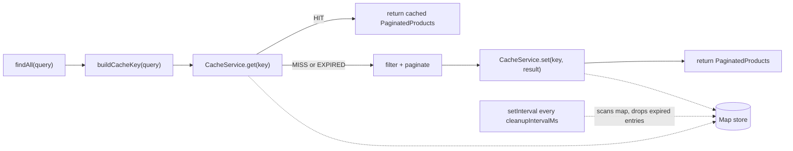

## Scope

### Create

- [backend/src/cache/interfaces/cache-entry.interface.ts](backend/src/cache/interfaces/cache-entry.interface.ts)
- [backend/src/cache/cache.service.ts](backend/src/cache/cache.service.ts)
- [backend/src/cache/cache.module.ts](backend/src/cache/cache.module.ts)

### Rewrite

- [backend/src/cache/README.md](backend/src/cache/README.md) — currently describes cache as "future phase"; update to reflect the delivered service.

### Modify

- [backend/src/app/products/products.module.ts](backend/src/app/products/products.module.ts) — import `CacheModule`.
- [backend/src/app/products/products.service.ts](backend/src/app/products/products.service.ts) — inject `CacheService`, integrate on `findAll`.

### Untouched

- [backend/src/app.module.ts](backend/src/app.module.ts) — no change needed. `CacheModule` is feature-scoped, not `@Global()`: `ProductsModule` declares its own dependency. This is cleaner than a global module (explicit collaborators, easier to test in isolation) and still fully reusable — any future feature just adds `CacheModule` to its own `imports: []`.
- [backend/src/app/products/products.controller.ts](backend/src/app/products/products.controller.ts) — untouched.

## Cache lifecycle



## Files

### 1. New: [backend/src/cache/interfaces/cache-entry.interface.ts](backend/src/cache/interfaces/cache-entry.interface.ts)

```ts
export interface CacheEntry<T> {
  value: T;
  expiresAt: number;
}
```

`expiresAt` is a millisecond timestamp (`Date.now()` + TTL). Cheaper to compare than storing "createdAt" + "ttl" separately.

### 2. New: [backend/src/cache/cache.service.ts](backend/src/cache/cache.service.ts)

```ts
import {
  Injectable,
  Logger,
  OnModuleDestroy,
  OnModuleInit,
} from '@nestjs/common';
import { CacheEntry } from './interfaces/cache-entry.interface';

export const CACHE_DEFAULT_TTL_MS = 5 * 60 * 1000;
export const CACHE_CLEANUP_INTERVAL_MS = 60 * 1000;

@Injectable()
export class CacheService implements OnModuleInit, OnModuleDestroy {
  private readonly logger = new Logger(CacheService.name);
  private readonly store = new Map<string, CacheEntry<unknown>>();
  private cleanupTimer?: NodeJS.Timeout;

  private readonly defaultTtlMs = CACHE_DEFAULT_TTL_MS;
  private readonly cleanupIntervalMs = CACHE_CLEANUP_INTERVAL_MS;

  onModuleInit(): void {
    this.cleanupTimer = setInterval(
      () => this.cleanup(),
      this.cleanupIntervalMs,
    );
    // Do not keep the Node.js event loop alive just for the cache cleanup.
    this.cleanupTimer.unref?.();
  }

  onModuleDestroy(): void {
    if (this.cleanupTimer) {
      clearInterval(this.cleanupTimer);
      this.cleanupTimer = undefined;
    }
  }

  get<T>(key: string): T | null {
    const entry = this.store.get(key);
    if (!entry) {
      this.logger.debug(`MISS ${key}`);
      return null;
    }
    if (entry.expiresAt <= Date.now()) {
      this.store.delete(key);
      this.logger.debug(`EXPIRED ${key}`);
      return null;
    }
    this.logger.debug(`HIT ${key}`);
    return entry.value as T;
  }

  set<T>(key: string, value: T): void {
    this.store.set(key, {
      value,
      expiresAt: Date.now() + this.defaultTtlMs,
    });
    this.logger.debug(`SET ${key}`);
  }

  delete(key: string): void {
    this.store.delete(key);
  }

  private cleanup(): void {
    const now = Date.now();
    let removed = 0;
    for (const [key, entry] of this.store) {
      if (entry.expiresAt <= now) {
        this.store.delete(key);
        removed++;
      }
    }
    if (removed > 0) {
      this.logger.log(`Cleanup: removed ${removed} expired entrie(s)`);
    }
  }
}
```

Key decisions:

- **`OnModuleInit` / `OnModuleDestroy`** for the `setInterval` — starting the timer in the constructor would create timers during unit tests without the module ever booting; destroying it on shutdown prevents Jest and CI runners from hanging.
- **`.unref?.()`** on the timer — a cache cleanup should never keep the Node process alive on its own. Guarded with `?.` in case a future test replaces the timer with a mock.
- **Exported `CACHE_DEFAULT_TTL_MS` / `CACHE_CLEANUP_INTERVAL_MS` constants** — the values are the *default policy*; the fields are private, so a subclass or replacement provider could override them cleanly. Meets the "configurable" requirement without adding a `forRoot(options)` layer we don't need yet.
- **Log levels**:
  - `logger.debug` for per-key `HIT` / `MISS` / `EXPIRED` / `SET` — these are high-frequency and belong at debug level. Visible under `NEST_LOG_LEVEL=debug` or `LOG_LEVEL=debug` without spamming production logs by default.
  - `logger.log` for the periodic cleanup summary — one line per interval, only when something was removed, per the spec ("Cleanup summary (number of expired entries removed)").
- **`get<T>` returns `T | null`** and casts internally (`entry.value as T`) — pragmatic type assertion, consistent with how most in-memory caches type themselves; callers own the key -> value contract.
- **Expiry check on `get`** — matches spec ("Automatically remove expired entries when accessed"). Guarantees no stale data even between cleanup ticks.
- **`for...of` over `Map`** — preserves insertion order and is safe to `delete()` while iterating (per ECMA spec).
- **No `clear()` method** — not requested. Would be trivial to add later.

### 3. New: [backend/src/cache/cache.module.ts](backend/src/cache/cache.module.ts)

```ts
import { Module } from '@nestjs/common';
import { CacheService } from './cache.service';

@Module({
  providers: [CacheService],
  exports: [CacheService],
})
export class CacheModule {}
```

- **Not `@Global()`** — feature modules import it explicitly (see rationale above).
- **`exports: [CacheService]`** — required so `ProductsModule` can inject the service.

### 4. Modify: [backend/src/app/products/products.module.ts](backend/src/app/products/products.module.ts)

```ts
import { Module } from '@nestjs/common';
import { CacheModule } from '../../cache/cache.module';
import { ProductsController } from './products.controller';
import { ProductsService } from './products.service';

@Module({
  imports: [CacheModule],
  controllers: [ProductsController],
  providers: [ProductsService],
})
export class ProductsModule {}
```

### 5. Modify: [backend/src/app/products/products.service.ts](backend/src/app/products/products.service.ts)

Add cache lookup at the top of `findAll` and cache the computed result on miss. Filtering/pagination logic (from Phase 5) is preserved as-is.

```ts
import { Injectable } from '@nestjs/common';
import { CacheService } from '../../cache/cache.service';
import { products } from './data/products.data';
import { ProductQueryDto } from './dto/product-query.dto';
import { PaginatedProducts } from './interfaces/paginated-products.interface';
import { Product } from './interfaces/product.interface';

@Injectable()
export class ProductsService {
  private readonly defaultPage = 1;
  private readonly defaultLimit = 10;
  private readonly cacheKeyPrefix = 'products:findAll';

  constructor(private readonly cacheService: CacheService) {}

  findAll(query: ProductQueryDto): PaginatedProducts {
    const cacheKey = this.buildCacheKey(query);

    const cached = this.cacheService.get<PaginatedProducts>(cacheKey);
    if (cached) {
      return cached;
    }

    const page = query.page ?? this.defaultPage;
    const limit = query.limit ?? this.defaultLimit;

    const filtered = this.applyFilters(products, query);
    const total = filtered.length;
    const totalPages = total === 0 ? 0 : Math.ceil(total / limit);

    const offset = (page - 1) * limit;
    const data = filtered.slice(offset, offset + limit);

    const result: PaginatedProducts = {
      data,
      total,
      page,
      limit,
      totalPages,
    };

    this.cacheService.set(cacheKey, result);

    return result;
  }

  private buildCacheKey(query: ProductQueryDto): string {
    const normalized = {
      page: query.page ?? this.defaultPage,
      limit: query.limit ?? this.defaultLimit,
      category: query.category ?? null,
      stock_status: query.stock_status ?? null,
    };
    return `${this.cacheKeyPrefix}:${JSON.stringify(normalized)}`;
  }

  private applyFilters(
    source: readonly Product[],
    query: ProductQueryDto,
  ): Product[] {
    return source.filter((product) => {
      if (query.category !== undefined && product.category !== query.category) {
        return false;
      }
      if (
        query.stock_status !== undefined &&
        product.stock_status !== query.stock_status
      ) {
        return false;
      }
      return true;
    });
  }
}
```

Key decisions on the integration:

- **Cache key = prefix + normalized JSON** — the prefix `products:findAll` avoids collisions when other features share the same cache (project rule: keep it reusable). `JSON.stringify` on an object with the four fields in a **fixed order** (`page, limit, category, stock_status`) makes keys deterministic: `?category=A&page=1` and `?page=1&category=A` produce the same key. `undefined` is normalized to `null` so `no filter` collapses to a single key. Defaults are applied *inside* the key (`page ?? 1`, `limit ?? 10`) so `GET /products` and `GET /products?page=1&limit=10` hit the same cache entry.
- **Cache-first, compute-on-miss** — the classic read-through pattern the spec describes. Business logic still lives entirely in the service; the controller stays a one-liner.
- **`cached` truthy check** — `PaginatedProducts` is always an object, so a hit is truthy; a miss returns `null` and falls through. Simple and correct.
- **No cache mutation on write paths** — there are no writes in this API, so no invalidation logic is needed. If a `POST /products` were added later, the service would call `cacheService.delete(...)` or a `clear()` helper.

### 6. Rewrite: [backend/src/cache/README.md](backend/src/cache/README.md)

Replace the "future phase" content with the delivered architecture. Sections to cover, in this order:

- **Cache architecture** — the folder contains a NestJS module (`CacheModule`) exporting one injectable (`CacheService`) backed by a plain `Map<string, CacheEntry<unknown>>`. Feature modules opt in by importing `CacheModule`. No `@Global()` scope, no external store, no dependency beyond `@nestjs/common`.
- **Cache key generation** — the *caller* owns the key (the cache stays domain-agnostic). Convention used by `ProductsService`: `{feature}:{operation}:{JSON with fixed field order}`, `undefined` normalized to `null`, defaults applied before serialization. Example: `products:findAll:{"page":1,"limit":10,"category":null,"stock_status":"in_stock"}`.
- **TTL** — default 5 minutes (`CACHE_DEFAULT_TTL_MS`), applied on `set`. Exposed as a constant so it can be tuned in one place.
- **Cleanup interval** — default 60 seconds (`CACHE_CLEANUP_INTERVAL_MS`), driven by `setInterval` started on `onModuleInit`, cleared on `onModuleDestroy`. Uses `.unref()` so it doesn't keep Node alive. Each tick sweeps expired entries and logs a `Cleanup: removed N` line when any entry was removed.
- **Cache lifecycle** — `SET` on write, `HIT` when a valid entry is returned, `MISS` when the key is absent, `EXPIRED` when the entry existed but its TTL has passed (also removed inline in `get`). All logged via NestJS `Logger` at `debug` level (per-key events) or `log` level (cleanup summary).
- **Integration with `ProductsService`** — read-through: on every `findAll(query)`, build the key, try `cacheService.get<PaginatedProducts>(key)`; on hit return immediately; on miss run filtering + pagination, `cacheService.set(key, result)`, return. Defaults inside the key mean equivalent queries (with or without defaults) share the same entry.
- **Why this separation improves maintainability** — cache is transport- and feature-agnostic: swapping the `Map` for Redis, or adding an interceptor variant later, changes only this folder.

## Verification

- `npm run build` compiles cleanly.
- Manual smoke checks after `npm run start`:
  - First `GET /products?page=1&limit=5` -> `MISS`, `SET`, then response.
  - Second identical request within 5 minutes -> `HIT`, same response, no filter recomputation.
  - Third request with `?page=2` -> different key -> `MISS`, `SET`.
  - Wait > 5 minutes (or lower `CACHE_DEFAULT_TTL_MS` locally) -> next request logs `EXPIRED` then `SET`.

## Deliverable summary (returned after execution)

- **Cache architecture** — `CacheModule` exporting a `CacheService` backed by an internal `Map<string, CacheEntry<T>>`. Generic (`get<T>`, `set<T>`, `delete`), feature-agnostic, no external dependency. TTL = 5 min, cleanup every 60 s via `setInterval` (started on `onModuleInit`, cleared on `onModuleDestroy`, unref'd to not block shutdown).
- **Cache lifecycle** — `SET` on write, `HIT` on live read, `EXPIRED` on read of a past-TTL entry (also removed inline), `MISS` when key absent, `Cleanup: removed N` on periodic sweep. All emitted via NestJS `Logger`.
- **Integration with `ProductsService`** — constructor DI of `CacheService`, `findAll` builds a deterministic key from `(page, limit, category, stock_status)` with defaults applied and `undefined -> null` normalization, tries the cache first, computes on miss, stores the result, and returns. Controller unchanged.
- **How repeated requests benefit** — identical queries within the TTL skip the filter/paginate work entirely and return the previously computed envelope directly from the in-memory `Map` (O(1) lookup). Different queries live under different keys and do not evict each other; equivalent queries (with vs without explicit defaults) share one entry because defaults are folded into the key.